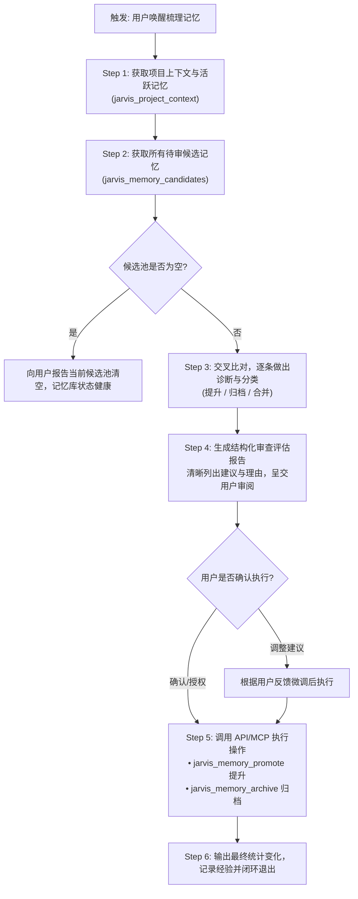

# Jarvis 认知记忆梳理与审核规范 (Memory Review & Consolidation Skill)

本技能定义了当使用者要求“梳理记忆”、“审核候选记忆”、“整理记忆库”时，AI Agent 必须遵循的标准操作规程（SOP）、审查价值判断准则及人机协同审核流程。

---

## 1. 核心定位与认知契约

Jarvis 认知架构严格规定：
- **客户端 Agent 绝不直接向长期语义记忆库写入内容**。
- 日常会话与任务结束时，由会话经验反思生成的记录均以 **“候选记忆（Candidate Memory）”** 状态暂存。
- **本技能是连接“瞬时经验”与“永久持久记忆”的关键审查桥梁**。通过人机协同的梳理与去粗取精，确保 Jarvis 的长期记忆库具备高密度、高信息增量、零冗余、不可磨灭的知识复用价值。

---

## 2. 触发时机 (Triggers)

### 自然语言唤醒词（模糊匹配）
- “帮我梳理一下记忆” / “梳理一下最近的候选记忆”
- “审核一下记忆库” / “审核候选记忆”
- “整理记忆” / “记忆库去重” / “清理冗余候选记忆”
- “review memory candidates” / “memory consolidation”

### 显式指令唤醒
- Antigravity 载入技能：`memory-review`
- Jarvis 认知管理控制台：在 `http://127.0.0.1:7330` 的“候选记忆池”界面手动调用或一键审核。

---

## 3. 记忆梳理与审核的五大判断准则

在审查待定候选记忆（Candidates）时，Agent 必须对照当前项目的**现有持久活跃记忆（Active Memories）**逐条做价值评估：

### 准则一：信息增量 (Information Delta)
- **拒绝流水账**：排除一次性修改日志（如“修改了 package.json 第 5 行”、“修复了某个变量拼写”）。
- **保留长期原则**：仅保留具备跨会话、跨需求、跨架构复用价值的**架构决策、用户偏好、系统事实、红线约束**。

### 准则二：去重与合并 (Deduplication & Consolidation)
- **重复复述**：如果某候选记忆只是对已存在的持久记忆换了一种说法表达，判定为**冗余项**，【建议归档】。
- **增量补充**：如果某候选记忆细化或修正了已有的持久记忆，建议在原记忆基础上提炼合并。
- **同批聚合**：如果单次会话反思生成了 3~5 条高度相似的同构候选，将其合并为一条高密度陈述后提升，其余候选【建议归档】。

### 准则三：规范化分类 (MemoryKind Taxonomy)
候选记忆提升时，必须明确其精准分类：
- `decision`：重要的架构选型、技术方案、设计决策（如“采用 macOS LaunchAgent 守护常驻”、“双轨端口隔离”）。
- `constraint`：项目硬性红线、开发禁忌、防御性边界（如“不随意停止现有运行服务”、“保护未跟踪改动”）。
- `preference`：用户的个人开发习惯、代码风格、协作偏好。
- `workflow`：经过验证的最佳实践、运维命令、标准化操作流程。
- `fact`：稳定的外部环境技术事实（如端口分配、平台限制）。

### 准则四：第三人称客观事实陈述 (Objective Fact Style)
- **标题（Title）**：凝练概括主题（10~25 字），直奔要点。
- **正文（Content）**：以客观、肯定、陈述句书写结论、依据与约束，去除“我们在本次任务中……”等第一人称叙述。

### 准则五：透明呈现，人机协同 (Human-in-the-loop Transparency)
- 严禁静默进行批量提升或全部删除。
- 必须先生成**结构化评审建议表格**向用户汇报，包括：
  - 【建议提升 (Promote)】及提升理由；
  - 【建议归档 (Archive)】及冗余理由；
  - 【建议合并 (Merge/Refine)】后的精炼内容。
- 征得使用者确认后，再通过工具接口执行落地。

---

## 4. 标准执行操作流程 (SOP)



### 详细步骤说明

#### Step 1: 获取项目上下文与现有持久记忆
- 调用 `jarvis_project_context(projectId)` 或 `jarvis_memory_search(projectId, query="")`。
- 掌握当前已生效的 `status: "active"` 长期记忆列表，建立基准参照线。

#### Step 2: 拉取待审核候选记忆
- 调用 `jarvis_memory_candidates(projectId)`。
- 获取当前项目中所有 `status: "candidate"` 的记录列表（记录 ID、标题、内容、revision、关联来源经验）。

#### Step 3: 逐条价值分析与交叉去重
- 对比 Active 记忆与同批 Candidates，将候选打上标记：
  1. `[PROMOTE]`：具有全新认知增量、架构决策或红线规则。
  2. `[ARCHIVE]`：属于过程性临时信息、无新信息增量或与已有 Active 记忆完全重叠。
  3. `[MERGE]`：内容有价值但同批次存在多条同类碎片，提炼为单一精品记录。

#### Step 4: 输出结构化审查评估卡片
向使用者展示格式规范的 Markdown 审查报告：

```markdown
### 🧠 Jarvis 记忆梳理与审核报告

**当前待审候选总数**：X 条 | **现有活跃持久记忆**：Y 条

#### 1. 建议正式提升为长期记忆 (Promote)：
| 候选 ID | 建议分类 | 拟定标题 | 提炼内容核心 | 提升理由与价值 |
|---|---|---|---|---|
| `memory_xxx` | `decision` | 双轨端口隔离设计 | 生产7330与开发7430共存 | 解决日常开发与常驻守护端口冲突的架构决策 |

#### 2. 建议归档与清理的冗余候选 (Archive)：
| 候选 ID | 候选标题 | 处置建议 | 归档理由 |
|---|---|---|---|
| `memory_yyy` | Session decision | 归档 | 与已有记忆重复，系过程性记录，无增量 |

---
*请确认是否按照上述方案执行批量提升与归档？（或告诉我需要调整的项）*
```

#### Step 5: 经用户确认后执行操作
- **提升候选为持久记忆**：
  调用 `jarvis_memory_promote`：
  ```json
  {
    "projectId": "<projectId>",
    "id": "<candidateId>",
    "expectedRevision": <expectedRevision>
  }
  ```
- **归档无效/冗余候选**：
  调用 `jarvis_memory_archive`：
  ```json
  {
    "id": "<candidateId>"
  }
  ```

#### Step 6: 同步最终状态与经验沉淀
- 向用户展示梳理结果小结（如：“已成功提升 1 条核心架构决策为持久记忆，归档 7 条冗余过程性候选，当前候选池已清空，长期记忆库保持最高信息密度”）。
- 调用 `jarvis_event_record` 记录梳理审计事件，保持认知自洽。
